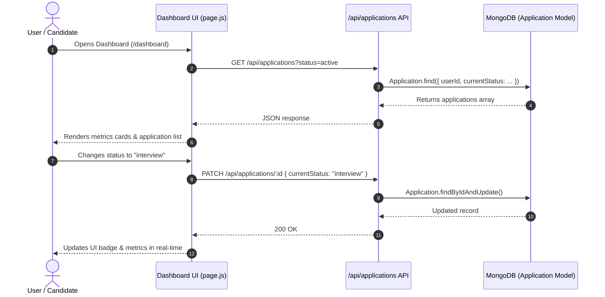

# Section 1: Dashboard & Pipeline

**Menu Item:** Dashboard & Pipeline  
**Routes:** `/dashboard`, `/dashboard/[id]`  
**Category:** Pipelines & Match

---

## 1. Overview & Purpose

The **Dashboard & Pipeline** is the central command center of CareerFlow AI. It manages the entire lifecycle of a candidate's job applications across all stages:
1. **Saved / Wishlist** (`saved`)
2. **Applied** (`applied`)
3. **Assessment / Online Test** (`assessment`)
4. **Interview Scheduled** (`interview`)
5. **Offer Received** (`offer`)
6. **Rejected / Archived** (`rejected`)

It provides visual status breakdowns, conversion metric highlights, quick-action status updates, an AI follow-up approval queue, full-text search, multi-criteria filtering, batch deletion, JSON export, and a drill-down detail view for individual applications.

---

## 2. Code File Structure

| File Path | Role / Layer | Description |
|-----------|--------------|-------------|
| [`src/app/dashboard/page.js`](file:///Users/anikethreddy/Documents/FSD-project/careerflow/src/app/dashboard/page.js) | Frontend View (Client) | Main Dashboard view with Kanban/list pipeline, top summary cards, follow-up outreach queue, search/filtering bar, and "Add Application" modal. |
| [`src/app/dashboard/[id]/page.js`](file:///Users/anikethreddy/Documents/FSD-project/careerflow/src/app/dashboard/[id]/page.js) | Frontend View (Client) | Application detail page showing the full timeline, recruiter details, notes, salary/job URLs, status changer, and outreach logs. |
| [`src/app/api/applications/route.js`](file:///Users/anikethreddy/Documents/FSD-project/careerflow/src/app/api/applications/route.js) | Backend API (REST) | `GET`: Lists user applications with filter, search, and sort query parameters. `POST`: Creates a new application record in MongoDB. |
| [`src/app/api/applications/[id]/route.js`](file:///Users/anikethreddy/Documents/FSD-project/careerflow/src/app/api/applications/[id]/route.js) | Backend API (REST) | `GET`: Fetches single application data. `PUT`/`PATCH`: Updates status, notes, company, or salary. `DELETE`: Deletes application. |
| [`src/app/api/outreach/route.js`](file:///Users/anikethreddy/Documents/FSD-project/careerflow/src/app/api/outreach/route.js) | Backend API (REST) | `GET`: Retrieves pending AI follow-up drafts requiring user approval. |
| [`src/app/api/outreach/[id]/route.js`](file:///Users/anikethreddy/Documents/FSD-project/careerflow/src/app/api/outreach/[id]/route.js) | Backend API (REST) | `PATCH`: Approves and sends draft, or dismisses/edits outreach email. |
| [`src/models/Application.js`](file:///Users/anikethreddy/Documents/FSD-project/careerflow/src/models/Application.js) | Database Schema | Mongoose schema storing company name, role title, status, applied date, job URL, recruiter contact, salary, and notes. |
| [`src/models/OutreachLog.js`](file:///Users/anikethreddy/Documents/FSD-project/careerflow/src/models/OutreachLog.js) | Database Schema | Stores AI-drafted follow-up emails, review status (`pending_review`, `approved`, `dismissed`), and timestamps. |
| [`src/lib/enums.js`](file:///Users/anikethreddy/Documents/FSD-project/careerflow/src/lib/enums.js) | Shared Constants | Standard enum values for `APPLICATION_STATUS`, `WORK_MODES`, `PRIORITY`. |
| [`src/lib/labels.js`](file:///Users/anikethreddy/Documents/FSD-project/careerflow/src/lib/labels.js) | UI Styling & Helpers | Badges, Tailwind color schemes, and human-readable labels for application statuses. |

---

## 3. Key Components & Features

### 3.1 Metrics Overview Cards
- **Total Applications**: Real-time count of tracked applications.
- **Active Applications**: Applications currently in `applied`, `assessment`, or `interview`.
- **Interviews Scheduled**: Count of companies that invited the candidate for an interview.
- **Offers Received**: Successful conversions to full-time/internship offers.

### 3.2 Action Queue: AI Follow-Up Approvals
- Displays outreach emails generated by the autonomous agent.
- **Human-in-the-Loop**: The user can **Approve**, **Edit text inline**, or **Dismiss** any follow-up before it is dispatched to recruiters.

### 3.3 Application Pipeline Cards
- Filter by status (`All`, `Applied`, `Interview`, `Assessment`, `Offer`, `Rejected`).
- Full-text search by **Company Name**, **Role Title**, or **Location**.
- Sort by **Recent Applied Date**, **Company Name**, or **Status Priority**.
- One-click status changer directly from each card.
- Direct links to original job postings (`jobUrl`).

### 3.4 Detailed Application View (`/dashboard/[id]`)
- Step-by-step application timeline showing exact status transition dates.
- Recruiter contact info (name, email, phone) with click-to-email links.
- Notes and preparation logs for upcoming interview rounds.

---

## 4. Data Flow Diagram

