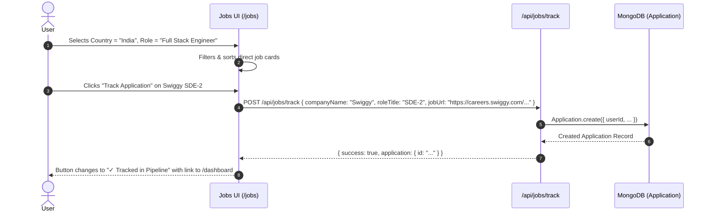

# Section 2: Recommended Jobs

**Menu Item:** Recommended Jobs  
**Route:** `/jobs`  
**Category:** Pipelines & Match

---

## 1. Overview & Purpose

The **Recommended Jobs** section connects candidates with curated tech opportunities matched against their profile skills, experience, and country preferences.

### Key Capabilities:
- **Live Direct Portal Application Links**: Every job card links directly to the specific job requisition on official company portals (e.g. Google Careers, Microsoft Careers, Uber Careers, Swiggy Careers, Flipkart Careers, Razorpay Greenhouse, CRED Lever, TCS iBegin, Infosys Careers, Zomato Careers).
- **Multi-Country Selection**: Filter by **India (Tier 1/2/3 & Startups)**, **United States**, **United Kingdom**, **Canada**, **Germany**, **Singapore**, or **Global Remote**.
- **Tier & Startup Diversity**: Includes MAANG/Tier-1 giants, Tier-2 leaders, fast-growing startups (Series A-D), and Indian service/consulting leaders.
- **Realistic Salary Filters**: From entry-level / early-career (₹3–10 LPA, $40k–80k) up to senior/staff levels (₹40–90+ LPA, $180k–300k+).
- **One-Click Pipeline Tracking**: Click **"Track Application"** to instantly add any recommended job directly into the user's `/dashboard` pipeline without leaving the page.
- **Dynamic Skill Match Badges**: Calculates and visualizes skill compatibility tags (e.g., `95% Match`, `React`, `Node.js`, `Python`, `AWS`).

---

## 2. Code File Structure

| File Path | Role / Layer | Description |
|-----------|--------------|-------------|
| [`src/app/jobs/page.js`](file:///Users/anikethreddy/Documents/FSD-project/careerflow/src/app/jobs/page.js) | Frontend View (Client) | Interactive Job Explorer UI with country filter dropdown, category pills, salary range slider, match badges, search bar, and "Track in Pipeline" buttons. |
| [`src/app/api/jobs/recommendations/route.js`](file:///Users/anikethreddy/Documents/FSD-project/careerflow/src/app/api/jobs/recommendations/route.js) | Backend API (REST) | Handles query parameters (`country`, `query`, `category`, `tier`, `maxSalary`) and invokes recommendation engine. |
| [`src/app/api/jobs/track/route.js`](file:///Users/anikethreddy/Documents/FSD-project/careerflow/src/app/api/jobs/track/route.js) | Backend API (REST) | Adds a selected job into the user's `Application` database collection with `status: 'applied'` or `'saved'`. |
| [`src/lib/jobs/recommendationEngine.js`](file:///Users/anikethreddy/Documents/FSD-project/careerflow/src/lib/jobs/recommendationEngine.js) | Engine / Matcher | Computes skill overlap and relevance score between candidate profile and available tech roles. |
| [`src/lib/jobs/jobDirectory.js`](file:///Users/anikethreddy/Documents/FSD-project/careerflow/src/lib/jobs/jobDirectory.js) | Data Repository | Extensive directory of authentic tech jobs across Tier 1, Tier 2, Tier 3, and Startups across India, US, and globally with direct application links. |
| [`src/lib/jobs/liveJobFetcher.js`](file:///Users/anikethreddy/Documents/FSD-project/careerflow/src/lib/jobs/liveJobFetcher.js) | Service | Fallback dynamic live job builder for custom user queries and location queries. |

---

## 3. Key Components & Features

### 3.1 Country Selector Dropdown
- **India (`IN`)**: Dedicated focus with 50+ real companies (Bangalore, Hyderabad, Pune, Gurgaon, Chennai, Remote).
- **United States (`US`)**: SF Bay Area, NYC, Seattle, Austin, Remote.
- **United Kingdom (`UK`)**, **Canada (`CA`)**, **Germany (`DE`)**, **Singapore (`SG`)**, and **Remote (`REMOTE`)**.

### 3.2 Tier & Company Classification
- **Tier 1 Tech**: Google, Microsoft, Amazon, Apple, Meta, Uber, Netflix.
- **Tier 2 Tech Leaders**: Atlassian, Adobe, Salesforce, Intuit, PayPal, Snowflake, Cisco.
- **High-Growth Startups & Unicorns**: Swiggy, Zomato, Razorpay, CRED, Zepto, Zerodha, Postman, Flipkart, Stripe, Databricks.
- **Tier 3 / Consulting & Enterprise IT**: TCS, Infosys, Wipro, Cognizant, HCLTech, Tech Mahindra.

### 3.3 Match Score Calculation
The engine compares the candidate's skills from `CandidateProfile` against the required technologies in the job listing:
$$\text{Match Score} = \min\left(98\%, 60\% + \left(\frac{|\text{Matching Skills}|}{|\text{Job Skills}|} \times 35\%\right)\right)$$

---

## 4. One-Click Tracking Workflow

