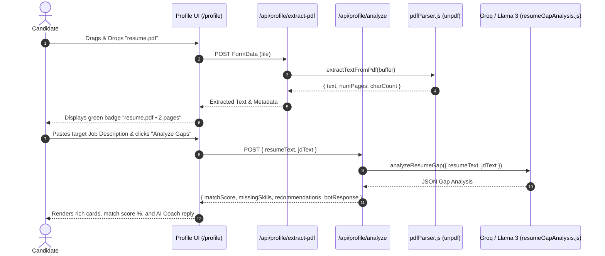

# Section 4: Candidate Profile & Gap Coach

**Menu Item:** Candidate Profile  
**Route:** `/profile`  
**Category:** Tools & Automation

---

## 1. Overview & Purpose

The **Candidate Profile** is the master repository of the user's professional identity and career assets. It serves two crucial roles:
1. **Master Candidate Data Store**: Holds contact info, education, experience, personal projects, skills, certifications, portfolio links, work authorization, and job preferences used by Browser Assist for auto-filling application forms.
2. **AI Resume vs JD Gap Analyzer & Coach**: A multi-modal AI coach that analyzes the candidate's resume (via PDF upload or pasted text) against any Job Description (JD) to pinpoint:
   - Match Fit Score (0–100%)
   - Missing Skills & Keywords (What the candidate lacks)
   - Strong Matches & Overlaps
   - Experience & Depth Gaps
   - Actionable Step-by-Step Recommendations
   - Interactive Follow-Up Coaching Chat

---

## 2. Code File Structure

| File Path | Role / Layer | Description |
|-----------|--------------|-------------|
| [`src/app/profile/page.js`](file:///Users/anikethreddy/Documents/FSD-project/careerflow/src/app/profile/page.js) | Frontend View (Client) | Master profile editor form + interactive AI Resume vs JD Gap Analyzer drawer, multi-modal PDF dropzone, extracted text preview, and AI coach chat. |
| [`src/app/api/profile/route.js`](file:///Users/anikethreddy/Documents/FSD-project/careerflow/src/app/api/profile/route.js) | Backend API (REST) | `GET`: Retrieves current user profile. `PUT`: Saves updated profile schema to MongoDB. |
| [`src/app/api/profile/extract-pdf/route.js`](file:///Users/anikethreddy/Documents/FSD-project/careerflow/src/app/api/profile/extract-pdf/route.js) | Backend API (REST) | `POST`: Receives `multipart/form-data` PDF file and returns extracted text, page count, and character length using `unpdf`. |
| [`src/app/api/profile/analyze/route.js`](file:///Users/anikethreddy/Documents/FSD-project/careerflow/src/app/api/profile/analyze/route.js) | Backend API (REST) | `POST`: Multi-modal gap analyzer accepting PDF files, base64 strings, or raw text + JD text and returning structured gap analysis. |
| [`src/app/api/profile/prefill/route.js`](file:///Users/anikethreddy/Documents/FSD-project/careerflow/src/app/api/profile/prefill/route.js) | Backend API (REST) | `POST`: Prefills profile with comprehensive test data for instant testing. |
| [`src/lib/pdfParser.js`](file:///Users/anikethreddy/Documents/FSD-project/careerflow/src/lib/pdfParser.js) | PDF Extraction Library | Robust, pure-memory PDF text extractor built on `unpdf` with native `Uint8Array` slicing (no worker thread dependencies). |
| [`src/lib/llm/resumeGapAnalysis.js`](file:///Users/anikethreddy/Documents/FSD-project/careerflow/src/lib/llm/resumeGapAnalysis.js) | LLM Gap Coach | Evaluates candidate resume against target JD requirements and produces JSON schema conforming outputs. |
| [`src/models/CandidateProfile.js`](file:///Users/anikethreddy/Documents/FSD-project/careerflow/src/models/CandidateProfile.js) | Database Schema | Mongoose schema with embedded arrays for education, experience, projects, skills, links, and preferences. |
| [`src/lib/testProfileData.js`](file:///Users/anikethreddy/Documents/FSD-project/careerflow/src/lib/testProfileData.js) | Seed / Test Data | Rich mock candidate profile for Full Stack / AI / ML engineers. |
| [`src/components/FormattedMarkdown.js`](file:///Users/anikethreddy/Documents/FSD-project/careerflow/src/components/FormattedMarkdown.js) | UI Component | Renders formatted markdown for AI coach responses, missing skills, and recommendations. |

---

## 3. Key Components & Features

### 3.1 Multi-Modal Resume Ingestion
- **PDF Drag & Drop / Upload**: Drop any `.pdf` resume (up to 10MB). Automatically parses text on the server via `unpdf`.
- **Text Preview Drawer**: Displays extracted text with character count and page count badges; allows instant editing.
- **Direct Paste Mode**: Paste raw resume text directly.
- **Auto-Fallback**: If no custom resume is provided, automatically draws from the candidate's saved profile in MongoDB.

### 3.2 AI Gap Analysis Engine
- **Match Score**: 0 to 100 percentage calculation.
- **Missing Skills (`missingSkills`)**: Highlighted in red/rose pills for missing frameworks, databases, or cloud tools.
- **Strengths (`matchingSkills`)**: Highlighted in emerald green pills.
- **Experience Gaps (`experienceGaps`)**: Identifies missing architectural depth, scale, or leadership requirements.
- **Recommendations (`recommendations`)**: Step-by-step guidance on projects, resume phrasing, or certifications to close gaps.
- **Interactive Coach Chat**: Candidates can ask follow-ups like *"How should I rewrite my bullet points for this?"* or *"Suggest a side project to bridge the Kafka gap."*

---

## 4. Multi-Modal Analysis Sequence

