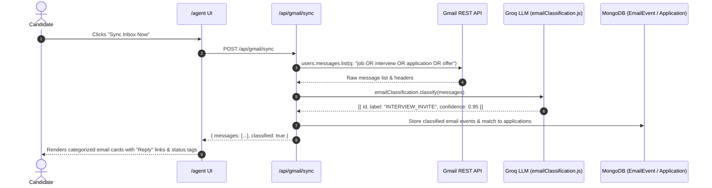

# Section 6: Agent Reasoner Logs & Gmail Sync

**Menu Item:** Agent Reasoner Logs  
**Route:** `/agent`  
**Category:** Tools & Automation

---

## 1. Overview & Purpose

The **Agent Reasoner Logs** section displays the autonomous background brain of CareerFlow AI. It executes intelligent monitoring loops over open applications and synchronizes with the candidate's Gmail inbox to classify recruiter communications.

### Core Autonomous Capabilities:
1. **Recruiter Email Triage (Gmail Sync)**:
   - Connects to Google Gmail via OAuth2.
   - Fetches recent recruiter and application threads.
   - Classifies each message using Groq AI into semantic labels:
     - `INTERVIEW_INVITE` (Interview invitation)
     - `ASSESSMENT_REQUEST` (Coding test / OA / take-home)
     - `REJECTION` (Application declined)
     - `OFFER` (Job offer extended)
     - `INFORMATIONAL` / `UNCLASSIFIED`
2. **Autonomous Reasoning Loop (`reasoner.js`)**:
   - Inspects all open applications against business rules (e.g. days since applied, last recruiter contact, staleness threshold).
   - Generates autonomous actions:
     - **Draft Follow-up (`DRAFT_FOLLOWUP`)**: Drafts a polite, professional follow-up email tailored to the specific company and role.
     - **Escalate (`ESCALATE`)**: Flags high-priority status changes (e.g. unexpected interview invites or offers).
     - **Status Update (`STATUS_CHANGE`)**: Recommends moving application stages based on recruiter emails.
     - **Wait (`WAIT` / `NO_ACTION`)**: Explicitly logs why no action was taken (e.g., applied only 2 days ago, recruiter requested 1 week).
3. **Audit Trail**: Full historical log of every reasoning cycle with timestamps, decisions, and rationale.

---

## 2. Code File Structure

| File Path | Role / Layer | Description |
|-----------|--------------|-------------|
| [`src/app/agent/page.js`](file:///Users/anikethreddy/Documents/FSD-project/careerflow/src/app/agent/page.js) | Frontend View (Client) | Agent activity control panel, "Run Agent Loop" button, Gmail OAuth status card, synced recruiter mailbox, and decision log timeline. |
| [`src/app/api/agent/run/route.js`](file:///Users/anikethreddy/Documents/FSD-project/careerflow/src/app/api/agent/run/route.js) | Backend API (REST) | `POST`: Triggers an on-demand agent reasoning cycle across user applications. |
| [`src/app/api/agent/logs/route.js`](file:///Users/anikethreddy/Documents/FSD-project/careerflow/src/app/api/agent/logs/route.js) | Backend API (REST) | `GET`: Returns past agent audit decision logs. |
| [`src/app/api/auth/google/start/route.js`](file:///Users/anikethreddy/Documents/FSD-project/careerflow/src/app/api/auth/google/start/route.js) | Backend API (OAuth) | Initiates Google OAuth consent flow with Gmail readonly scopes. |
| [`src/app/api/auth/google/callback/route.js`](file:///Users/anikethreddy/Documents/FSD-project/careerflow/src/app/api/auth/google/callback/route.js) | Backend API (OAuth) | Handles OAuth callback, exchanges code for refresh token, stores encrypted credentials. |
| [`src/app/api/auth/google/status/route.js`](file:///Users/anikethreddy/Documents/FSD-project/careerflow/src/app/api/auth/google/status/route.js) | Backend API (OAuth) | Returns Gmail connection state (`connected: true/false`, email address). |
| [`src/app/api/auth/google/disconnect/route.js`](file:///Users/anikethreddy/Documents/FSD-project/careerflow/src/app/api/auth/google/disconnect/route.js) | Backend API (OAuth) | Revokes tokens and disconnects Gmail integration. |
| [`src/app/api/gmail/sync/route.js`](file:///Users/anikethreddy/Documents/FSD-project/careerflow/src/app/api/gmail/sync/route.js) | Backend API (REST) | Pulls recruiter emails via Gmail API and classifies them with Groq LLM. |
| [`src/lib/agent/reasoner.js`](file:///Users/anikethreddy/Documents/FSD-project/careerflow/src/lib/agent/reasoner.js) | Reasoner Logic | Evaluates single application state and determines next best action. |
| [`src/lib/agent/runCycle.js`](file:///Users/anikethreddy/Documents/FSD-project/careerflow/src/lib/agent/runCycle.js) | Agent Orchestrator | Iterates across all active applications, evaluates rules, creates draft follow-ups, and logs audit records. |
| [`src/lib/llm/emailClassification.js`](file:///Users/anikethreddy/Documents/FSD-project/careerflow/src/lib/llm/emailClassification.js) | LLM Classifier | Zero-shot / few-shot Groq prompt that categorizes incoming recruiter emails. |
| [`src/lib/llm/draftFollowUp.js`](file:///Users/anikethreddy/Documents/FSD-project/careerflow/src/lib/llm/draftFollowUp.js) | LLM Generator | Drafts personalized recruiter follow-up emails based on role details, days elapsed, and candidate profile. |
| [`src/lib/google/oauth.js`](file:///Users/anikethreddy/Documents/FSD-project/careerflow/src/lib/google/oauth.js) | Google OAuth Client | Handles Google OAuth2 client creation, redirect URLs, and authorization code exchanges. |
| [`src/lib/google/tokens.js`](file:///Users/anikethreddy/Documents/FSD-project/careerflow/src/lib/google/tokens.js) | Token Store & Refresh | Manages token refresh lifecycle and expiration verification. |
| [`src/lib/google/gmail.js`](file:///Users/anikethreddy/Documents/FSD-project/careerflow/src/lib/google/gmail.js) | Gmail API Client | Queries Gmail messages using filters (`from:recruiting`, `subject:interview`, etc.) and decodes message snippets. |
| [`src/models/AgentActionLog.js`](file:///Users/anikethreddy/Documents/FSD-project/careerflow/src/models/AgentActionLog.js) | Database Schema | Mongoose schema storing cycle timestamp, decision type, application reference, reasoning summary, and action taken. |

---

## 3. Autonomous Reasoner Decision Matrix

```text
[Application Status] + [Days Since Last Update] + [Recruiter Email Classification]
                              │
                              ▼
                   ┌───────────────────────┐
                   │ Agent Reasoner Loop   │
                   └──────────┬────────────┘
                              │
       ┌──────────────────────┼──────────────────────┬──────────────────────┐
       ▼                      ▼                      ▼                      ▼
[Applied > 7 Days]     [Assessment Recv]      [Interview Invite]     [Applied < 3 Days]
       │                      │                      │                      │
       ▼                      ▼                      ▼                      ▼
  DRAFT_FOLLOWUP          ESCALATE             STATUS_CHANGE             NO_ACTION / WAIT
"Draft polite check-in" "Flag urgent OA deadline" "Move to Interview" "Within normal window"
```

---

## 4. Gmail Sync & AI Triage Flow


